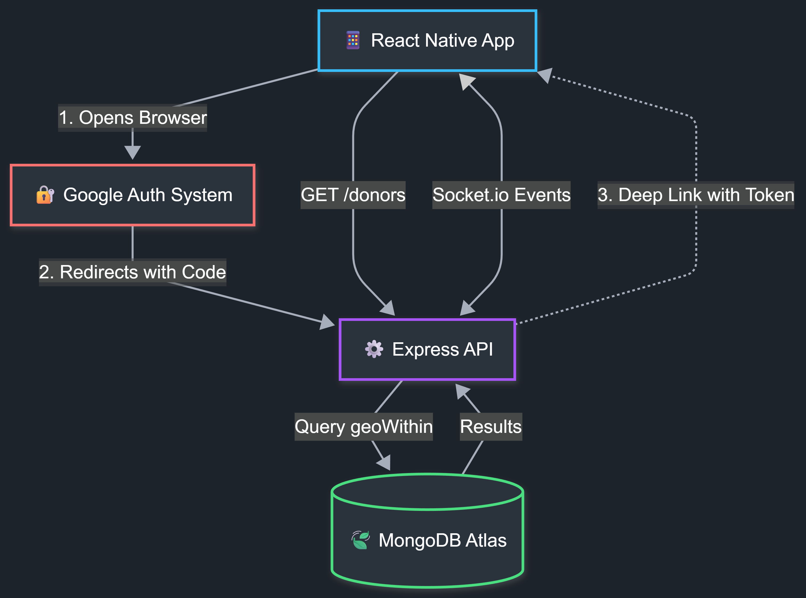

## The Problem: Logistics, Not Lack

In emergency situations, the bottleneck isn't usually a lack of blood donors; it's an **information gap**. Finding a donor with the right blood type within a reachable distance often involves frantic calls and WhatsApp spam.

I built **BloodZone** to solve this logistics problem using engineering. The goal was to create an "Uber-like" experience for blood donation: finding the nearest eligible donor in milliseconds, not hours.

## The Architecture

BloodZone follows a 3-tier architecture designed for speed and reliability. Unlike simple CRUD apps, the complexity here lies in three key areas: the **Geospatial Engine**, the **Real-Time Communication layer**, and the **Secure Identity System**.

**The Stack:**

- **Mobile:** React Native (Expo) - Optimized for Android.
- **API:** Node.js & Express (TypeScript).
- **Database:** MongoDB Atlas (Utilizing 2dsphere indexing).
- **Real-Time:** Socket.io with custom middleware guards.
- **Auth:** Google OAuth 2.0 (Deep Link + Server Exchange).


_Figure 1: High-level system architecture showing the Round-Trip Auth flow, Geospatial Query engine, and Real-Time Sockets._

---

## Key Engineering Challenges

### 1. The "Radius" Problem (Geospatial Logic)

The core feature of the app is finding donors within a strict boundary (e.g., exactly 5km). Initially, I considered fetching all users and filtering them in JavaScript, but I realized that would kill performance as the user base grew.

I moved this logic to the database layer using MongoDB's `$geoWithin` combined with `$centerSphere`. The tricky part was the math: MongoDB requires radians, so I had to implement a converter to translate kilometers into radian coordinates relative to Earth's radius.

```typescript
// The query that saved me from fetching 10k records
const users = await UserModel.find({
  location: {
    $geoWithin: {
      $centerSphere: [
        [longitude, latitude],
        radiusInKm / 6378.1 // Converting km to radians
      ]
    }
  }
});
```

### 2. Securing Open Sockets (Real-Time Auth)

I used **Socket.io** to allow seekers to chat directly with donors. The biggest risk with WebSockets is that they often bypass standard HTTP Auth headers, leaving the chat server vulnerable to spam bots.

To fix this, I implemented a **Handshake Middleware**. Before a socket connection is even "upgraded" to a real-time link, the backend intercepts the handshake, extracts the JWT, and verifies the user identity. If the token is invalid, the socket is forcibly disconnected before any data is exchanged.

### 3. Deep-Link Authentication (Handling State)

Security was a priority, so I didn't want to handle Google passwords inside the app. I opted for a "Round Trip" Deep Link strategy.

When a user logs in, the app throws them out to the system browser (Chrome/Safari) for a secure Google login. The challenge was getting them _back_ into the app with the session intact. I had to configure a custom URL scheme (`bloodzone://`) so that once the server verified the user, it could "wake up" the app from the background and inject the secure tokens directly into the device's secure storage.

### 4. Architecting Real-Time Alerts (The Push Pipeline)

Blood donation relies on speed. To ensure donors are notified the second a request is generated nearby, I engineered a custom push notification infrastructure that bridges **Expo**, **MongoDB Geospatial Queries**, and **Firebase Cloud Messaging (FCM)**.

**1. Idempotent Token Synchronization**
The client lifecycle relies on a custom `usePushNotifications` hook to manage tokens. I implemented an **idempotent synchronization pattern**, ensuring that device tokens in the database remain consistent and unique without redundant network calls or duplicate records on the backend.

**2. Geospatial Aggregation Engine**
The backend utilizes MongoDB’s `2dsphere` indexing to execute precise, real-time proximity checks. When a request is triggered, the aggregation pipeline simultaneously filters active users within a **5,000-meter radius**, excludes the requester, and validates token availability—reducing database load by combining discovery and filtering into a single operation.

**3. Modern FCM Delivery Infrastructure**
I migrated away from legacy server keys in favor of the **Firebase Cloud Messaging V1 API**. By configuring Expo with a Google Service Account, the system dynamically mints short-lived **OAuth 2.0 access tokens**. This establishes a secure, authenticated relay for reliable message delivery to Android devices without managing long-lived secrets.

---

## Lessons Learned & Future Scope

Building BloodZone taught me two critical engineering lessons that tutorials don't cover:

1. **Database > Code:** My first prototype tried to calculate distances using a JavaScript function. It was slow and crashed the app with large datasets. Moving that logic to MongoDB's geospatial index reduced query times by ~90%. It taught me to let the database do the heavy lifting.
2. **State Management is Tricky:** Handling the "app-to-browser-to-app" jump for OAuth was the hardest bug to squash. I learned the hard way that mobile apps often lose their "state" when backgrounded, requiring robust checks when the app re-mounts.

**Current Constraints:**

- The app is currently optimized and tested for **Android** devices.
- iOS support is in beta due to specific styling differences in the React Native engine.

**Next Steps:**
Now that the main features are working, I want to fix any small bugs that come up during testing and finish the design tweaks needed to make the app run smoothly.

---

### Project Links

- **[Watch Demo Video](https://youtube.com/shorts/AOj7_smdNtQ)**
- **[Request Access (Email)](mailto:thexeromin@gmail.com?subject=BloodZone%20Access)**
- _Note: This project is currently in closed beta._
