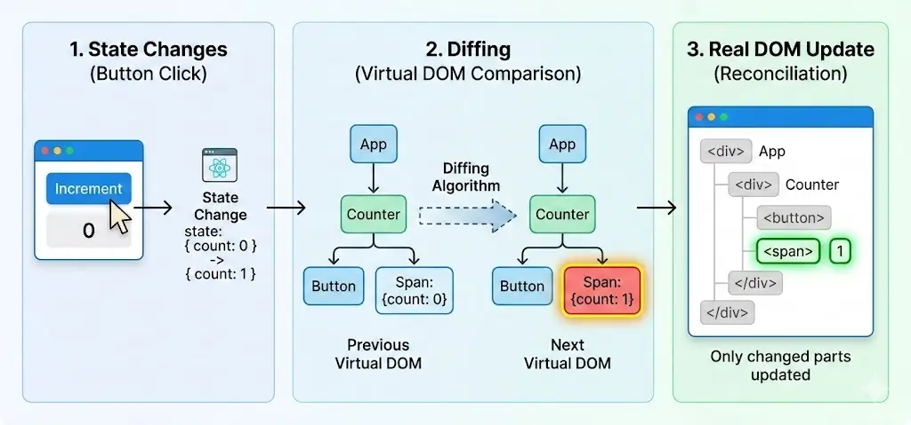

Earlier, I had a misconception that if React re-renders, it’s a bad thing because extra work is being done.

I believed that when re-rendering happens, React has to do the same work again and again. So I thought, why repeat the same rendering process multiple times?

While deep diving into React, I learned about the Virtual DOM.

The real DOM is part of the browser and updating it is expensive. The Virtual DOM, however, is just a JavaScript representation of the real DOM. Updating the Virtual DOM is much cheaper compared to directly manipulating the real DOM.

Under the hood, when state changes, React creates a new Virtual DOM.

Then it compares the new Virtual DOM with the previous one. This process is called diffing.

If React finds differences, it updates only the changed parts in the real DOM instead of re-rendering everything. This entire cycle of creating a new tree, diffing it, and updating the browser is known as Reconciliation.

Re-rendering can become a problem in some cases:

- **If a child component performs an expensive task**
  - If the child component runs an expensive calculation during rendering, it may slow down performance.
  - We can use `React.useMemo` to memoize the calculated value so it only recomputes when its dependencies change.
- **When a parent component updates but the child’s props do not change**
  - By default, when a parent re-renders, its child components also re-render.
  - We can prevent unnecessary child re-renders by wrapping the child component with `React.memo`.
- **When passing a function as a prop**
  - Every time a parent re-renders, functions inside it are recreated.
  - Since functions are compared by reference, React treats it as a new prop, even if the logic is the same.
  - We can use the `React.useCallback` hook to memoize the function and keep its reference stable between renders.

## Final Takeaway

Re-rendering itself is not bad in React. React is designed to handle it efficiently using the Virtual DOM. The real problem is unnecessary expensive operations during re-renders, not the re-rendering process itself.
